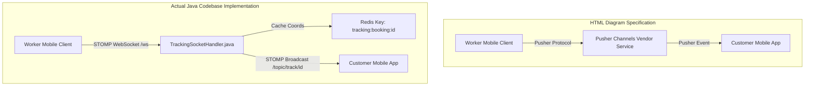

# ⚠️ HomeEase API & Architecture Mismatch Audit Report

> **Purpose**: Detailed audit comparing the **HTML Frontend Architecture Specification** against the **Actual Spring Boot Backend Codebase** (`c:\Users\saikr\OneDrive\Desktop\Urban`).

---

## 📌 Executive Summary of Discrepancies

| Discrepancy Type | Total Found | Impact Level | Primary Cause |
| :--- | :---: | :---: | :--- |
| **API Path Prefix Mismatch** | 12 Endpoints | 🟡 Medium | HTML omits `/v1` prefix across all standard endpoints. |
| **Authentication Flow Mismatch** | 3 Endpoints | 🔴 High | HTML uses raw OTP routes (`/api/auth/otp/send`), Backend uses Firebase OAuth ID Tokens (`/api/v1/auth/firebase-login`). |
| **Worker Action Route Mismatch** | 5 Endpoints | 🔴 High | HTML uses generic PATCH routes (`/api/bookings/{id}/status`), Backend uses explicit worker routes (`/api/v1/workers/bookings/...`). |
| **Real-Time Live Tracking Protocol** | 1 System | 🔴 High | HTML references third-party **Pusher Channels**, Backend implements **Spring STOMP WebSockets + Redis**. |
| **Microservices Route Mismatch** | 6 Endpoints | 🟡 Medium | HTML uses `/internal/...` prefixes, Backend uses `/api/v1/dispatch/...` and `/api/v1/notifications/...`. |
| **APIs Missing in HTML** | 24 Endpoints | 🟡 Medium | Backend contains complete Admin and Worker modules omitted from HTML diagrams. |

---

## ❌ 1. Direct API Endpoint Mismatches (HTML vs Actual Java Code)

The following table lists every endpoint defined in the HTML diagram that does **NOT MATCH** the actual Java backend controllers:

| Feature Area | HTML Specified API | Actual Backend Java API | Mismatch Details & Required Fix |
| :--- | :--- | :--- | :--- |
| **Auth / Login** | `POST /api/auth/otp/send` | *None (Handled by Firebase SDK)* | **Backend doesn't issue OTPs via REST.** Authentication relies on client-side Firebase token validation. |
| **Auth / Verification** | `POST /api/auth/otp/verify` | `POST /api/v1/auth/firebase-login` | **Payload mismatch.** Backend expects `firebaseToken` in `AuthController.java`. |
| **Auth / Session** | `GET /api/auth/refresh` | `GET /api/v1/users/me` | **Endpoint mismatch.** Session profile is retrieved via `/api/v1/users/me`. |
| **Sub-Services Catalog** | `GET /api/catalog/subservices/{id}` | `GET /api/v1/services/{id}/sub-services` | **Hierarchy mismatch.** In Backend, sub-services are requested under their parent Service UUID. |
| **Coupon Validation** | `POST /api/catalog/coupon/validate` | `POST /api/v1/coupons/validate` | **Path mismatch.** Backend places coupon validation directly under `/api/v1/coupons/validate`. |
| **Job Acceptance** | `PATCH /api/bookings/{id}/status` | `POST /api/v1/workers/bookings/{id}/accept` | **Verb & Path mismatch.** Backend uses explicit POST endpoint in `BookingController.java`. |
| **Job Rejection** | `PATCH /api/bookings/{id}/status` | `POST /api/v1/workers/bookings/{id}/reject` | **Verb & Path mismatch.** Rejection is handled via a dedicated endpoint with 1-hour block penalty. |
| **PIN Verification** | `PATCH /api/bookings/{id}/status` | `POST /api/v1/workers/bookings/{id}/verify-pin` | **Verb & Path mismatch.** PIN entry is verified at `/workers/bookings/{id}/verify-pin`. |
| **Job Completion** | `PATCH /api/bookings/{id}/status` | `POST /api/v1/workers/bookings/{id}/complete` | **Verb & Path mismatch.** Job completion is triggered at `/workers/bookings/{id}/complete`. |
| **Extra Sub-Services** | `POST /api/bookings/{id}/line-items` | `POST /api/v1/workers/bookings/{id}/add-sub-service` | **Path mismatch.** Adding on-site extra items uses `/workers/bookings/{id}/add-sub-service`. |
| **Billing Engine** | `POST /api/billing/calculate` | *Embedded in `BookingStateMachine`* | **Architecture mismatch.** No separate `BillingController` exists in Backend. |
| **Invoicing** | `GET /api/billing/invoice/{bookingId}` | *Embedded in `BookingResponse`* | **Architecture mismatch.** Invoice breakdown is returned directly inside `BookingResponse`. |
| **Payment Webhook** | `POST /api/payments/webhook` | `POST /api/v1/payments/webhooks` | **Path mismatch.** Plural `/webhooks` prefix with `/v1` in `PaymentWebhookController.java`. |

---

## ⚠️ 2. APIs Present in Codebase but Omitted in HTML

The HTML specification completely omits the following **24 Backend APIs** implemented in your Java controllers:

### A. Worker Partner Operations ([`WorkerController.java`](file:///c:/Users/saikr/OneDrive/Desktop/Urban/src/main/java/com/homeease/backend/controller/WorkerController.java))
- `POST /api/v1/workers/register-kyc` *(Submit Aadhaar, PAN, Bank Details)*
- `POST /api/v1/workers/status` *(Toggle online/offline status)*
- `POST /api/v1/workers/location` *(Update live latitude & longitude)*
- `GET /api/v1/workers/earnings` *(Fetch partner financial earnings log)*

### B. Customer Account & Bookings ([`AuthController.java`](file:///c:/Users/saikr/OneDrive/Desktop/Urban/src/main/java/com/homeease/backend/controller/AuthController.java) & [`BookingController.java`](file:///c:/Users/saikr/OneDrive/Desktop/Urban/src/main/java/com/homeease/backend/controller/BookingController.java))
- `POST /api/v1/users/register` *(User profile creation)*
- `GET /api/v1/bookings/my-bookings` *(Customer booking history)*

### C. Admin Governance & Platform Operations ([`AdminController.java`](file:///c:/Users/saikr/OneDrive/Desktop/Urban/src/main/java/com/homeease/backend/controller/AdminController.java))
- `POST /api/v1/admin/auth/login`
- `GET /api/v1/admin/dashboard/stats`
- `GET /api/v1/admin/payments` & `GET /api/v1/admin/payments/{id}`
- `PATCH /api/v1/admin/payments/{id}/status`
- `GET / POST / PUT / DELETE /api/v1/admin/services`
- `GET / POST / PUT / DELETE /api/v1/admin/sub-services`
- `POST / PATCH / DELETE /api/v1/admin/banners`
- `GET / POST / PATCH / DELETE /api/v1/admin/coupons`
- `GET /api/v1/admin/locations/workers` & `customers` & `live-map`
- `GET / POST /api/v1/admin/workers` & `GET /api/v1/admin/workers/{id}`
- `PUT /api/v1/admin/workers/{id}/verify-kyc` & `block` & `unblock`
- `GET / PATCH /api/v1/admin/users`
- `POST /api/v1/admin/notifications/instant` & `schedule`

---

## 📡 3. Infrastructure & Microservices Mismatches

### A. Live GPS Location Tracking Protocol Mismatch

- **HTML Specification**: Claims tracking uses **Pusher Channels** (`private-booking-{id}`).
- **Actual Java Code**: Implements **Native Spring Boot STOMP WebSockets** ([`TrackingSocketHandler.java`](file:///c:/Users/saikr/OneDrive/Desktop/Urban/src/main/java/com/homeease/backend/controller/TrackingSocketHandler.java)) with **Redis Caching**, and fallback REST endpoints ([`TrackingController.java`](file:///c:/Users/saikr/OneDrive/Desktop/Urban/homeease-tracking-service/src/main/java/com/homeease/tracking/controller/TrackingController.java)).

### B. Microservice Endpoint Route Mismatches

| Microservice | HTML Endpoint Path | Actual Backend Endpoint Path | File Reference |
| :--- | :--- | :--- | :--- |
| **Dispatch Service** | `POST /internal/dispatch/candidates` `POST /internal/dispatch/reject` | `POST /api/v1/dispatch/trigger` `POST /api/v1/dispatch/accept` `POST /api/v1/dispatch/reject` | [`DispatchController.java`](file:///c:/Users/saikr/OneDrive/Desktop/Urban/homeease-dispatch-service/src/main/java/com/homeease/dispatch/controller/DispatchController.java) |
| **Notification Service** | `POST /internal/notify/candidate-alert` `POST /internal/notify/assigned` `POST /internal/notify/pin` `POST /internal/notify/completed` | `POST /api/v1/notifications/push` | [`NotificationController.java`](file:///c:/Users/saikr/OneDrive/Desktop/Urban/homeease-notification-service/src/main/java/com/homeease/notification/controller/NotificationController.java) |

---

## 🔧 4. Recommended HTML Action Plan

To sync your HTML Architecture Specification with your actual Java codebase, make the following quick updates in the HTML file JavaScript dataset:

1. **Update Auth Endpoints**: Change `/api/auth/otp/verify` to `/api/v1/auth/firebase-login`.
2. **Update Tracking Tech**: Replace **Pusher Channels** badge & details with **Spring STOMP WebSockets + Redis**.
3. **Update Worker Endpoints**: Update endpoints on `BookingStateMachine` node to:
   - `POST /api/v1/workers/bookings/{id}/accept`
   - `POST /api/v1/workers/bookings/{id}/reject`
   - `POST /api/v1/workers/bookings/{id}/verify-pin`
   - `POST /api/v1/workers/bookings/{id}/add-sub-service`
   - `POST /api/v1/workers/bookings/{id}/complete`
4. **Add Worker & Admin Nodes**: Add explicit cards for `WorkerController` (`/api/v1/workers/*`) and `AdminController` (`/api/v1/admin/*`).
