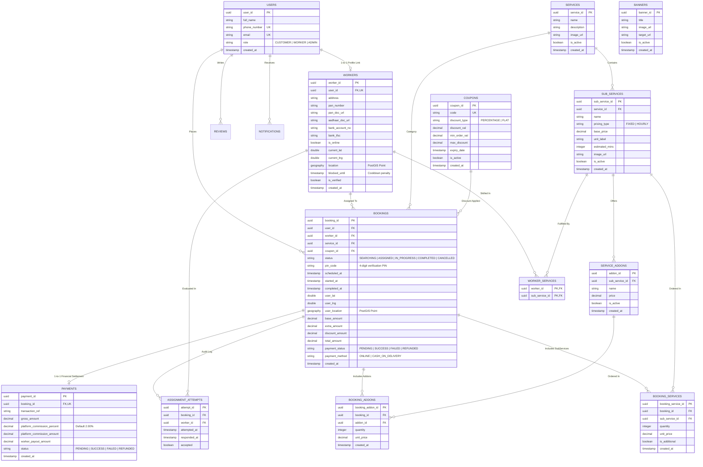

# 🗄️ HomeEase Platform - Complete End-to-End Database ERD & Schema Manual

> **Database System**: PostgreSQL + PostGIS (Spatial Location Extension)  
> **ORM Engine**: Hibernate / Spring Data JPA  
> **Key Design**: Fully Normalized Relational Schema with PostGIS Geography Indexing & Spatial Dispatch Log.

---

## 📊 1. Complete Entity-Relationship (ER) Diagram



---

## 🔍 2. End-to-End Detailed Table & Field Breakdown

### 1. `users` Table (Identity & Accounts)
Stores core account credentials for Customers, Workers, and Admins.
- **`user_id`** (`UUID`, Primary Key): Auto-generated unique user identifier.
- **`full_name`** (`VARCHAR(100)`, Required): User's full display name.
- **`phone_number`** (`VARCHAR(20)`, Unique, Required): Primary phone number used for login & OTP verification.
- **`email`** (`VARCHAR(150)`, Unique, Nullable): Email address for receipts & admin portal login.
- **`role`** (`VARCHAR(20)`, Required): Account type enum (`CUSTOMER`, `WORKER`, `ADMIN`).
- **`created_at`** (`TIMESTAMP`, Required): Registration timestamp.

---

### 2. `workers` Table (Service Partner Profiles & KYC)
Extends `users` table for service partner governance and PostGIS live tracking.
- **`worker_id`** (`UUID`, Primary Key): Auto-generated worker ID.
- **`user_id`** (`UUID`, Foreign Key → `users.user_id`, Unique): 1-to-1 mandatory link to the `users` account.
- **`address`** (`TEXT`, Required): Partner residential address.
- **`pan_number`** (`VARCHAR(20)`, Required): Government PAN number.
- **`pan_doc_url`** (`TEXT`, Required): Cloud storage link to PAN document image.
- **`aadhaar_doc_url`** (`TEXT`, Required): Cloud storage link to Aadhaar document image.
- **`bank_account_no`** (`VARCHAR(30)`, Required): Bank account number for direct net payouts.
- **`bank_ifsc`** (`VARCHAR(20)`, Required): Bank IFSC Code.
- **`is_online`** (`BOOLEAN`, Required, Default `false`): Availability toggle for spatial dispatch candidate search.
- **`current_lat`** / **`current_lng`** (`DOUBLE`): Last known latitude and longitude coordinates.
- **`location`** (`GEOGRAPHY(Point,4326)`): PostGIS spatial point column for high-speed spatial distance queries (`ST_DWithin`).
- **`blocked_until`** (`TIMESTAMP`, Nullable): Expiry timestamp for temporary disciplinary lockout penalties (e.g., 1-hour ban upon job rejection).
- **`is_verified`** (`BOOLEAN`, Required, Default `false`): KYC approval flag set by Admin.

---

### 3. `services` Table (Main Service Verticals)
Top-level service categories displayed on the customer mobile app home screen.
- **`service_id`** (`UUID`, Primary Key): Unique category identifier.
- **`name`** (`VARCHAR(100)`, Required): Category title (e.g. *Cleaning & Pest Control*, *Appliance Repair*).
- **`description`** (`TEXT`): Overview description of services included.
- **`image_url`** (`TEXT`, Required): Hero thumbnail icon image URL.
- **`is_active`** (`BOOLEAN`, Default `true`): Soft-delete / visibility flag.

---

### 4. `sub_services` Table (Service Package Items)
Specific items/packages under a parent service vertical.
- **`sub_service_id`** (`UUID`, Primary Key): Unique sub-service identifier.
- **`service_id`** (`UUID`, Foreign Key → `services.service_id`): Parent service vertical link.
- **`name`** (`VARCHAR(100)`, Required): Sub-service title (e.g. *Bathroom Deep Cleaning*).
- **`pricing_type`** (`VARCHAR(20)`, Enum: `FIXED`, `HOURLY`): Billing model.
- **`base_price`** (`DECIMAL(10,2)`, Required): Unit price in INR (e.g. ₹499.00).
- **`unit_label`** (`VARCHAR(30)`): Billing unit descriptor (e.g. *per bathroom*, *per AC unit*).
- **`estimated_mins`** (`INTEGER`, Required): Estimated completion duration in minutes.
- **`image_url`** (`TEXT`, Required): Item icon URL.

---

### 5. `service_addons` Table (Optional Package Add-ons)
Optional extra items that can be attached to a sub-service.
- **`addon_id`** (`UUID`, Primary Key): Addon identifier.
- **`sub_service_id`** (`UUID`, Foreign Key → `sub_services.sub_service_id`): Parent sub-service link.
- **`name`** (`VARCHAR(100)`, Required): Addon title (e.g. *Exhaust Fan Cleaning*).
- **`price`** (`DECIMAL(10,2)`, Required): Addon cost in INR (e.g. ₹99.00).

---

### 6. `worker_services` Table (Skill Matrix Mapping)
Junction table linking workers to the sub-services they are qualified to fulfill.
- **`worker_id`** (`UUID`, Composite PK / FK → `workers.worker_id`)
- **`sub_service_id`** (`UUID`, Composite PK / FK → `sub_services.sub_service_id`)

---

### 7. `coupons` Table (Promotions & Discounts)
Promo codes managed by Admin for customer order discounts.
- **`coupon_id`** (`UUID`, Primary Key): Unique coupon identifier.
- **`code`** (`VARCHAR(50)`, Unique, Required): Promo code string (e.g. `FESTIVE50`).
- **`discount_type`** (`VARCHAR(20)`, Enum: `PERCENTAGE`, `FLAT`): Discount mode.
- **`discount_val`** (`DECIMAL(10,2)`, Required): Percentage rate (e.g. `20.0`) or flat amount.
- **`min_order_val`** (`DECIMAL(10,2)`): Minimum cart total required for applicability.
- **`max_discount`** (`DECIMAL(10,2)`): Cap limit for percentage discounts.
- **`expiry_date`** (`TIMESTAMP`): Expiration timestamp.

---

### 8. `bookings` Table (Core Service Order State Machine)
The primary transactional table tracking booking lifecycle, pin security, spatial location, and payment status.
- **`booking_id`** (`UUID`, Primary Key): Unique order reference ID.
- **`user_id`** (`UUID`, Foreign Key → `users.user_id`): Customer who created the booking.
- **`worker_id`** (`UUID`, Foreign Key → `workers.worker_id`, Nullable): Assigned worker partner.
- **`service_id`** (`UUID`, Foreign Key → `services.service_id`): Main service category.
- **`coupon_id`** (`UUID`, Foreign Key → `coupons.coupon_id`, Nullable): Discount coupon applied.
- **`status`** (`VARCHAR(30)`, Enum: `SEARCHING`, `ASSIGNED`, `IN_PROGRESS`, `COMPLETED`, `CANCELLED`): Current state machine status.
- **`pin_code`** (`VARCHAR(4)`, Required): Auto-generated 4-digit security PIN verified by worker on arrival.
- **`scheduled_at`** (`TIMESTAMP`, Required): Date & time when service is scheduled.
- **`started_at`** / **`completed_at`** (`TIMESTAMP`): Timestamps recorded when PIN is verified and when job is finished.
- **`user_lat`** / **`user_lng`** (`DOUBLE`): Service address coordinates.
- **`user_location`** (`GEOGRAPHY(Point,4326)`): PostGIS point for spatial dispatch distance evaluation.
- **`base_amount`** (`DECIMAL(10,2)`): Base service cost.
- **`extra_amount`** (`DECIMAL(10,2)`): On-site additional work cost appended by worker.
- **`discount_amount`** (`DECIMAL(10,2)`): Coupon discount subtracted.
- **`total_amount`** (`DECIMAL(10,2)`): Final invoice total (`base + extra - discount`).
- **`payment_status`** (`VARCHAR(20)`, Enum: `PENDING`, `SUCCESS`, `FAILED`, `REFUNDED`)
- **`payment_method`** (`VARCHAR(20)`, Enum: `ONLINE`, `CASH_ON_DELIVERY`)

---

### 9. `booking_services` Table (Booked Sub-Service Items)
Line items specifying sub-services attached to a booking order.
- **`booking_service_id`** (`UUID`, Primary Key)
- **`booking_id`** (`UUID`, Foreign Key → `bookings.booking_id`)
- **`sub_service_id`** (`UUID`, Foreign Key → `sub_services.sub_service_id`)
- **`quantity`** (`INTEGER`, Default `1`)
- **`unit_price`** (`DECIMAL(10,2)`)
- **`is_additional`** (`BOOLEAN`, Default `false`): `true` if appended on-site by worker during execution.

---

### 10. `booking_addons` Table (Booked Addon Items)
Line items specifying optional add-ons attached to a booking order.
- **`booking_addon_id`** (`UUID`, Primary Key)
- **`booking_id`** (`UUID`, Foreign Key → `bookings.booking_id`)
- **`addon_id`** (`UUID`, Foreign Key → `service_addons.addon_id`)
- **`quantity`** (`INTEGER`, Default `1`)
- **`unit_price`** (`DECIMAL(10,2)`)

---

### 11. `assignment_attempts` Table (Spatial Dispatch Audit Log)
Audit log capturing candidate dispatch offers sent to workers during spatial matching.
- **`attempt_id`** (`UUID`, Primary Key)
- **`booking_id`** (`UUID`, Foreign Key → `bookings.booking_id`)
- **`worker_id`** (`UUID`, Foreign Key → `workers.worker_id`)
- **`attempted_at`** (`TIMESTAMP`)
- **`responded_at`** (`TIMESTAMP`)
- **`accepted`** (`BOOLEAN`): `true` if accepted, `false` if rejected/timed out.

---

### 12. `payments` Table (Financial Settlement & 2% Platform Commission)
Tracks gross payments, 2% platform commission deductions, and net partner payouts.
- **`payment_id`** (`UUID`, Primary Key)
- **`booking_id`** (`UUID`, Foreign Key → `bookings.booking_id`, 1-to-1 Unique)
- **`transaction_ref`** (`VARCHAR(100)`): Payment gateway transaction ID (Razorpay/Stripe).
- **`gross_amount`** (`DECIMAL(10,2)`): Total customer payment.
- **`platform_commission_percent`** (`DECIMAL(5,2)`, Default `2.00`): Platform commission rate (2.00%).
- **`platform_commission_amount`** (`DECIMAL(10,2)`): Computed platform fee (`gross_amount * 0.02`).
- **`worker_payout_amount`** (`DECIMAL(10,2)`): Net worker payout (`gross_amount - commission`).
- **`status`** (`VARCHAR(20)`, Enum: `PENDING`, `SUCCESS`, `FAILED`, `REFUNDED`)

---

## 🔄 3. End-to-End Transactional Data Flows

### A. Booking Creation & Spatial Dispatch Flow
1. **Customer Request**: Customer calls `POST /api/v1/bookings` with address coordinates (`userLat`, `userLng`), sub-services, and optional coupon.
2. **Database Insert**:
   - Inserts row into `bookings` (`status = SEARCHING`, generates `pin_code`).
   - Inserts rows into `booking_services` and `booking_addons`.
   - Populates `user_location` PostGIS Point column: `ST_SetSRID(ST_MakePoint(lng, lat), 4326)`.
3. **Spatial Candidate Search**:
   - `dispatch-service` queries Redis key `active_workers_geo` using `GEOSEARCH ... BYRADIUS 5 km`.
   - Fallback SQL query executed in PostgreSQL:
     ```sql
     SELECT w.* FROM workers w
     JOIN worker_services ws ON w.worker_id = ws.worker_id
     WHERE w.is_online = true 
       AND w.is_verified = true
       AND (w.blocked_until IS NULL OR w.blocked_until < NOW())
       AND ws.sub_service_id IN (:subServiceIds)
       AND ST_DWithin(w.location, :userLocation, 5000);
     ```
4. **Offer Log**: Inserts record into `assignment_attempts` for each candidate worker evaluated.

### B. Worker Acceptance / Rejection Flow
- **If Worker Accepts**:
  - `bookings.worker_id` updated to candidate worker ID.
  - `bookings.status` updated to `ASSIGNED`.
  - Push notification dispatched to customer containing worker details & security PIN.
- **If Worker Rejects**:
  - Worker account updated: `workers.blocked_until = NOW() + INTERVAL '1 hour'`.
  - Worker removed from Redis spatial index (`GEOREM active_workers_geo {workerId}`).
  - `assignment_attempts.accepted` set to `false`.
  - Dispatch engine queries next nearest candidate in 5 km radius.

### C. Job Execution & On-Site Addons Flow
1. **Arrival & PIN Verification**: Worker calls `POST /api/v1/workers/bookings/{id}/verify-pin`. Backend verifies `pin_code`. Updates `bookings.status = IN_PROGRESS` and `started_at = NOW()`.
2. **Real-time Live Location**: Worker updates GPS via WebSocket (`/app/track/{bookingId}`). Coordinates stored in Redis key `tracking:booking:{id}`.
3. **On-Site Extra Items**: Worker calls `POST /api/v1/workers/bookings/{id}/add-sub-service`. Inserts new row in `booking_services` with `is_additional = true`. Re-calculates `extra_amount` and `total_amount` in `bookings`.

### D. Completion & Financial Payout Settlement Flow
1. **Completion**: Worker calls `POST /api/v1/workers/bookings/{id}/complete`. Updates `bookings.status = COMPLETED` and `completed_at = NOW()`.
2. **Commission & Settlement**: Inserts row into `payments`:
   - `gross_amount` = `bookings.total_amount`
   - `platform_commission_amount` = `gross_amount * 0.02`
   - `worker_payout_amount` = `gross_amount - platform_commission_amount`
3. **Razorpay Route Auto-Split**: Triggers automated payout transfer of `worker_payout_amount` to partner bank account.

---

### E. Real-Time Live Location Tracking & Spatial Flow

> **Architecture Note**: Live location tracking uses a hybrid **Database + Redis + WebSocket** strategy to ensure sub-second latency while keeping database I/O minimal.

1. **Database Persistence (`workers` table)**:
   - `workers.current_lat` and `workers.current_lng` store last known latitude & longitude.
   - `workers.location` (`GEOGRAPHY(Point,4326)`) stores the PostGIS spatial point used by `dispatch-service` for `ST_DWithin` spatial candidate matching.
   - Admin live map fetches coordinates via `GET /api/v1/admin/locations/live-map` directly from database/cache.

2. **Redis In-Memory Live Cache (`tracking-service`)**:
   - Live worker GPS pings sent while online/on-job are cached in Redis key `tracking:booking:{bookingId}` with coordinates `"lat,lng"`.
   - Redis spatial index `active_workers_geo` maintains active worker coordinates for `GEOSEARCH ... BYRADIUS 5 km`.

3. **Real-time STOMP WebSocket Streaming**:
   - Worker mobile client streams location every ~5 seconds over STOMP WebSocket to `/app/track/{bookingId}`.
   - `TrackingSocketHandler.java` receives payload, updates Redis, and broadcasts live position to topic `/topic/track/{bookingId}` where the Customer Mobile App receives live map updates.

